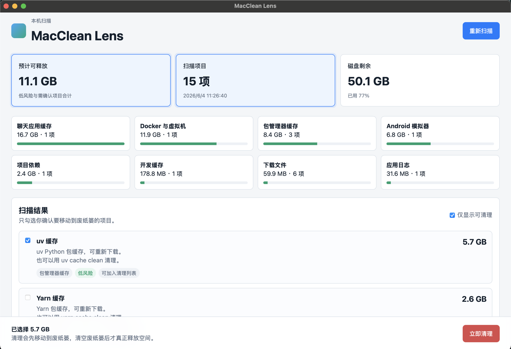

# MacClean Lens

MacClean Lens is a lightweight macOS disk cleanup assistant installed with npm. It scans common cleanup candidates, shows them visually, and moves selected items to Trash only after confirmation.



## Install

```bash
npm install -g mac-clean-lens
```

Install the native macOS app into Applications:

```bash
mac-clean-lens-install
```

You can then open it from Launchpad by searching for `MacClean Lens`.

## Update

Update the npm package and reinstall the native macOS app:

```bash
mac-clean-lens-update
```
The installer bundles the Node.js runtime currently running npm into the native app, so Launchpad does not depend on your shell `PATH`. Run `mac-clean-lens-install` again after upgrading the package.

## Usage

Open the visual scanner:

```bash
mac-clean-lens
```

Other commands:

```bash
mac-clean-lens --port 3900  # open UI on a fixed port
mac-clean-lens --no-open    # start server without opening a browser
mac-clean-lens scan --json  # print scan report JSON
mac-clean-lens-install      # install the native Launchpad app
mac-clean-lens-update       # update npm package and reinstall the app
```

## Safety

- Cleanable items are allowlisted cache, log, dependency, download, or large-file candidates.
- Manual items such as Docker data, chat app containers, and Android SDK images are shown as recommendations.
- Cleanup moves selected paths into `~/.Trash/MacCleanLens-<timestamp>/`. Empty Trash manually to actually release disk space.

## Development

```bash
npm test
npm run scan
npm start
npm run build:mac
npm run install:mac
```
